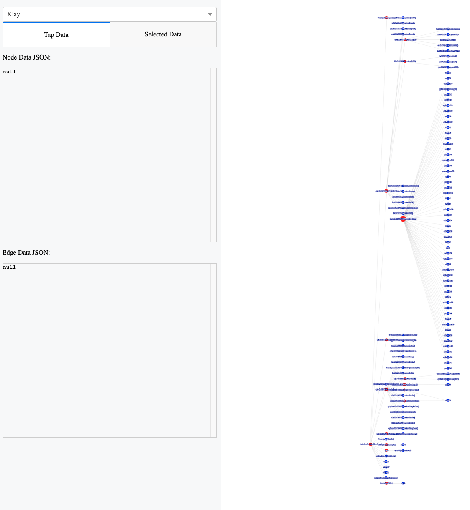
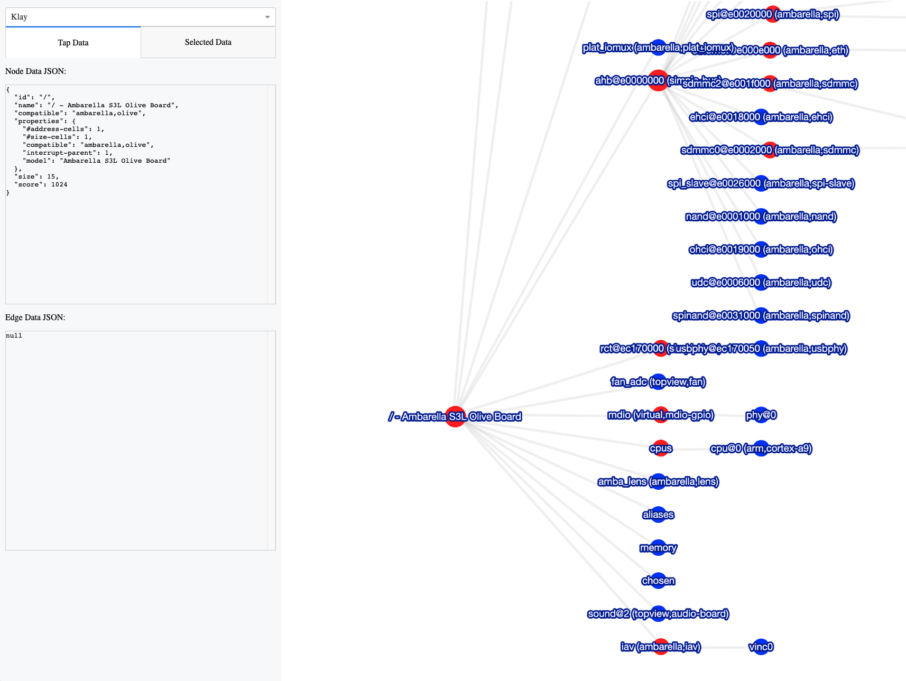
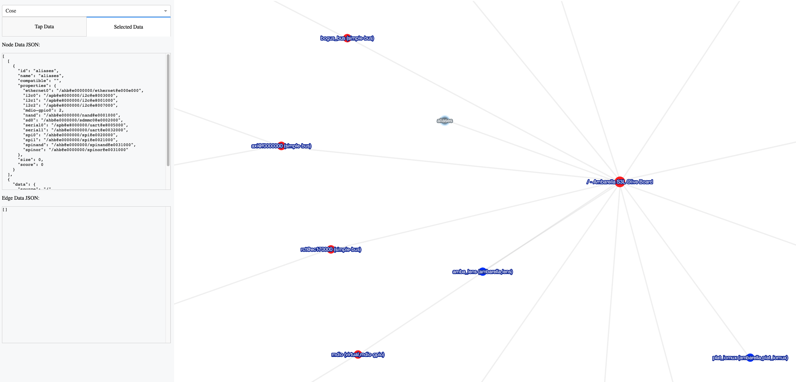

# Device Tree Blob/Source Visualizer

Simple project to make browsing through a `.dtb`/`.dts` file a little less mundane.

```
./device_tree.py -h                                                                                                                                                                                                                                                        <aws:prod_dev>
usage: device_tree.py [-h] -f FILE

Generate network type graph for device tree

optional arguments:
  -h, --help            show this help message and exit
  -f FILE, --file FILE  pass file to analyze
```






